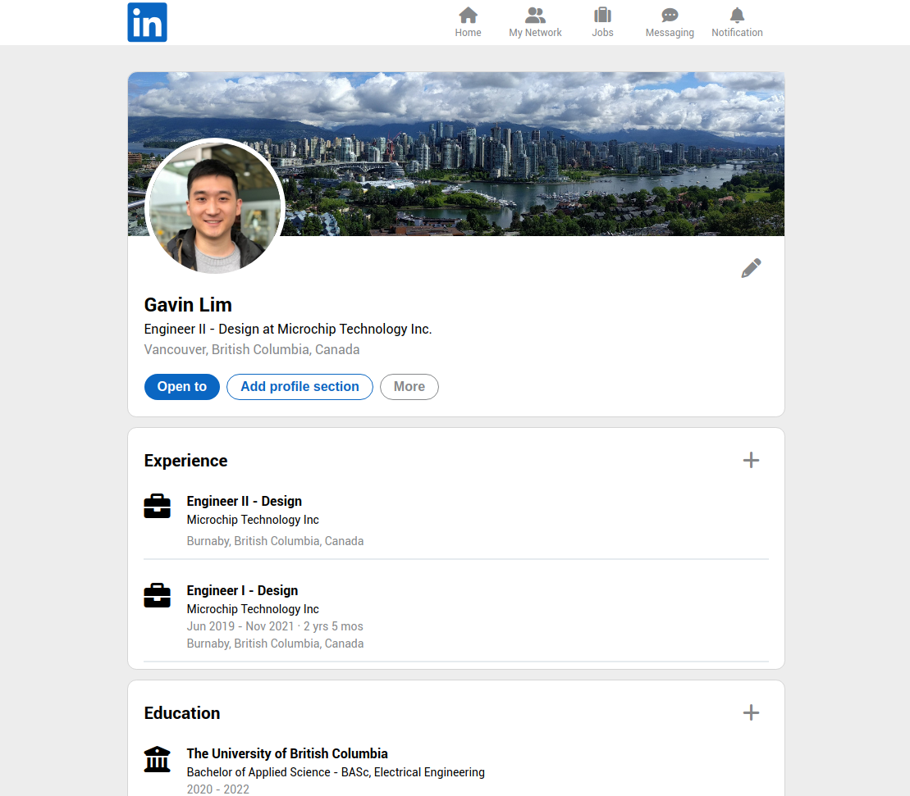

# LinkedIn 
Purpose of this project was to mimic the LinkedIn profile page using ReactJS class components (ie: state and props). 

 


## Features

- Bootstrapped with [Create React App](https://github.com/facebook/create-react-app)
- ReactJS (class components)

## Built With

- ReactJS
- HTML5
- CSS3

## Live Demo

[LinkedIn](http://gavinslim.com/linkedin/) :briefcase:

## Setup

1. Clone the repository:<br>```git clone https://github.com/gavinslim/linkedin.git```

2. Inside the cloned repo, install the required dependencies:<br>```npm install```

3. Initiate live demo:<br>```npm run start```

4. Produce the distribution files:<br>```npm run build```